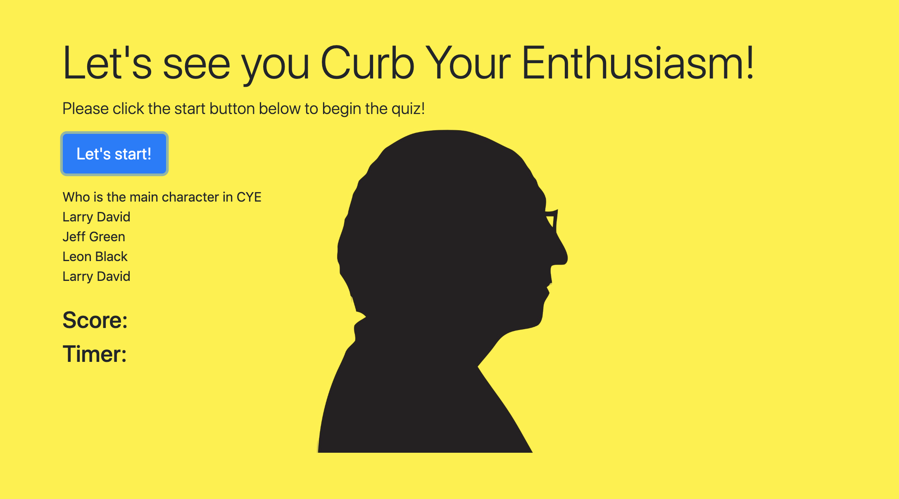

# QUIZ APP

## USER STORY

- Let's test your knowledge of the show "Curb Your Enthusiasm".
- You have 60 seconds to complete all the questions in the quiz.
- If you are a Larry David's fan, you'd love this game!

## App
![Link to app] (http://iamha1.github.io/)

## Screenshot

## How to do the quiz:
- Create 3 files: 1 html for the page, 1 JavaScript file for all the variables and functions, 1 JavaScript file for all the questions in the quiz.

- For the hltm file: add jumbotron, picture, set the theme for the quiz, set up class and id for variables, classes and ids that are mentioned in the JavaScript file.
- For the pop quiz JavaScript file: set up the variables, function for timer, function for score, function for choosing the correct answers.
- For the question Javascript file: another seperate file for questions in the quiz.

Copyright: https://getbootstrap.com, https://www.hbo.com/curb-your-enthusiasm, https://www.javascript.com/
